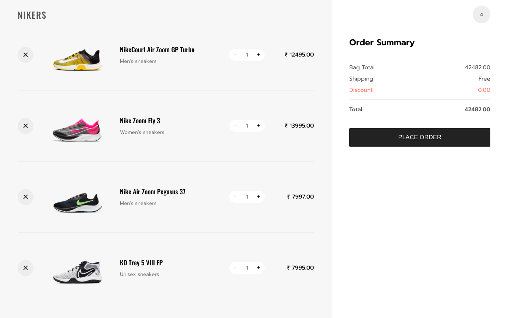

<h1> 
  👟 Sneakers Store App using React and Express
</h1>

> MERN Shopping cart created with React, NodeJS, MongoDB

### 🏠 [Shopping Cart](https://react-shopping-cart-xvov.onrender.com)



## Prerequisites

- Node > 12 or LTS
- npm or yarn
- MongoDB installed on local machine

## Getting Started

Clone or Download

```sh
git clone https://github.com/shubhambattoo/shopping-cart.git
cd shopping-cart
```

Run `npm install` to install all the dependencies

Creating a .env file

```
PORT=3000
DATABASE_HOST=mongodb://yoururl/
DATABASE_NAME=yourDBNAME
NODE_ENV=development
```

To import the Mock Products Data to MongoDB

```sh
cd /data
mongoimport --db [yourDBName] --collection products --file products.json --jsonArray
```

To start up the backend services run, `npm start` this will start the backend service on PORT 3000

## Client Side

Development

```
cd client
npm install
npm start
```

This should start up the React application on PORT 3001 and you open [http://localhost:3001](http://localhost:3001)

## Contributing

Contributions, issues and feature requests are welcome!
Feel free to check [issues](https://github.com/shubhambattoo/shopping-cart/issues) page.

View [CONTRIBUTING.md](https://github.com/shubhambattoo/shopping-cart/blob/master/CONTRIBUTING.md) to learn about the style guide, folder structure, scripts, and how to contribute.

## Contributors

<table>
  <tr>
    <td align="center"><a href="https://www.shubhambattoo.in"><br /><sub><b>Shubham Battoo</b></sub></a><br /><a href="https://github.com/shubhambattoo/shopping-cart/commits/master?author=shubhambattoo" title="Code">💻</a><a href="https://github.com/shubhambattoo/shopping-cart/commits/master?author=shubhambattoo" title="Documentation">📖</a> <a href="#infra-shubhambattoo" title="Infrastructure (Hosting, Build-Tools, etc)">🚇</a>
    </td>
    <td align="center"><a href="https://www.manojbarman.in/"><br /><sub><b>Manoj Barman</b></sub></a><br /><a href="https://github.com/shubhambattoo/shopping-cart/commits/master?author=itsmanojb" title="Code">💻</a>
    </td>
  </tr>
</table>

## Author

Shubham Battoo

- Twitter: [@Shubham_batt](https://twitter.com/Shubham_batt)
- Github: [@shubhambattoo](https://github.com/shubhambattoo)

## Show your support

Give a ⭐️ if this project helped you!
